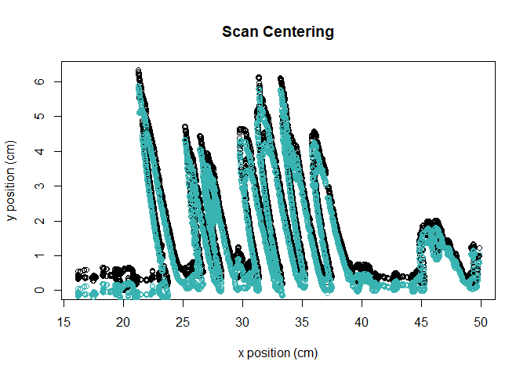
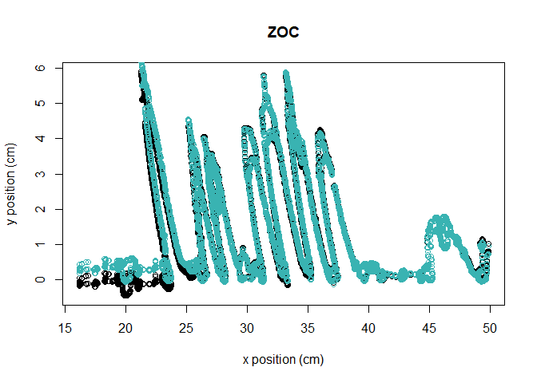
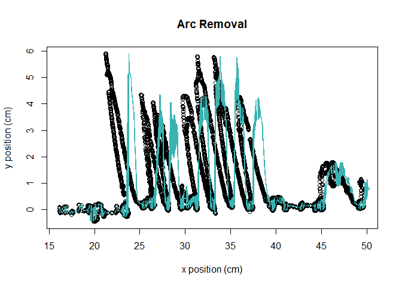
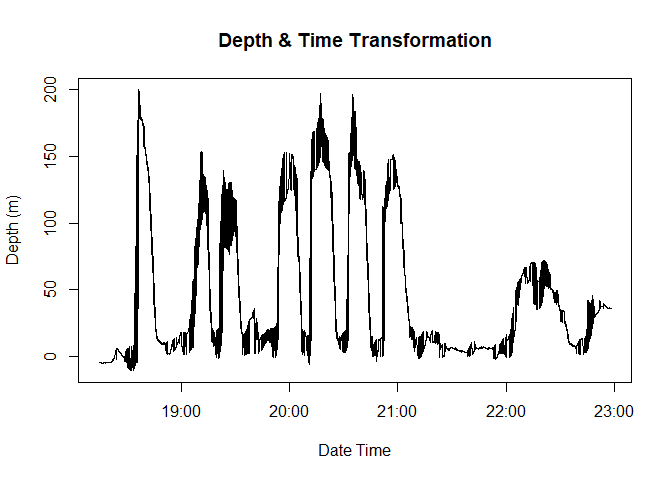
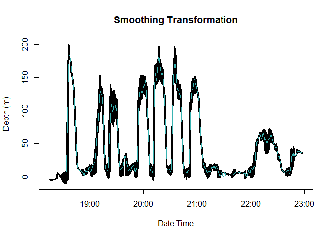

recoverKBTDR
================

<!-- README.md is generated from README.Rmd. Please edit this file -->

# recoverKBTDR

<!-- badges: start -->

[](https://cran.r-project.org/web/licenses/GPL-3.0)
[](https://github.com/EmmaLiTsai/recoverKBTDR/commits/main)
[](https://github.com/EmmaLiTsai/recoverKBTDR/actions)
<!-- badges: end -->

## Overview

This package contains a suite of functions for recovering dive records
from 1970’s film-based Kooyman-Billups Time Depth Records (KBTDRs). This
TDR was among the first placed on a free-ranging marine organism, but
the film-based format of the behavioral data makes long-term comparisons
exceptionally challenging. This package returns a corrected, continuous,
and digitized file of a KBTDR record complete with dates, times, and
depth that can be easily read into dive analysis software.

There are six main recovery steps that are achieved in this package:

1.  Scan centering and zero-offset correction
2.  Arc removal
3.  X-axis transformation to dates & times
4.  Interpolation between missing points
5.  Y-axis transformation to depth
6.  Spline smoothing

## Installation

You can install the released version of recoverKBTDR from
[CRAN](https://CRAN.R-project.org) with:

``` r
# install.packages("recoverKBTDR")

# alternatively, load the development version: 
devtools::install_github("EmmaLiTsai/recoverKBTDR")
```

    ## Skipping install of 'recoverKBTDR' from a github remote, the SHA1 (79f9f3b1) has not changed since last install.
    ##   Use `force = TRUE` to force installation

``` r
library(recoverKBTDR)
```

## Example of workflow

This is a basic example of the intended workflow for historic record
recovery:

First, read in data after scan image processing:

``` r
# examples of data tidying from raw ImageJ csv files: 
filepath <- system.file("extdata", "WS_25_1981", package = "recoverKBTDR")
filepath_trace <- paste(filepath, "WS_25_1981_trace.csv", sep = "/")

tidy_trace <- tidy_raw_trace(filepath_trace)
head(tidy_trace)
```

    ##   x_val y_val
    ## 1 0.190 0.624
    ## 2 0.190 0.611
    ## 3 0.312 0.652
    ## 4 0.312 0.624
    ## 5 0.312 0.611
    ## 6 0.312 0.570

``` r
# showing tidy data that is included within the package:
data(trace)
head(trace)
```

    ## # A tibble: 6 x 2
    ##   x_val y_val
    ##   <dbl> <dbl>
    ## 1 0.19  0.624
    ## 2 0.19  0.611
    ## 3 0.312 0.652
    ## 4 0.312 0.624
    ## 5 0.312 0.611
    ## 6 0.312 0.57

``` r
data(time_dots)
head(time_dots)
```

    ## # A tibble: 6 x 2
    ##   x_val  y_val
    ##   <dbl>  <dbl>
    ## 1  1.73 -0.279
    ## 2  3.23 -0.294
    ## 3  4.65 -0.302
    ## 4  6.07 -0.314
    ## 5  7.50 -0.331
    ## 6  8.91 -0.354

Center the scan using the timing dots, such that all timing dots will be
centered along y = -center_along_y. This helps remove drift in alignment
due to record scanning:

``` r
# centering along y = -0.9: 
trace <- center_scan(trace, time_dots, center_along_y = 0.9)

# visualizing the centered record: 
plot(tidy_trace[1000:11000,], xlab = "x position (cm)", ylab = "y position (cm)", type = "p", main = "Scan Centering") 
points(trace[1000:11000,], col = "#39b3b2")
```

<!-- -->

``` r
# also extract the centered psi calibration curve: 
psi_calibration <- centered_psi_calibration(trace, psi_interval = c(100, 200, 400, 600, 800))

head(psi_calibration)
```

    ##   psi_interval psi_position
    ## 1          100     1.689131
    ## 2          200     3.749440
    ## 3          400     8.321658
    ## 4          600    13.440813
    ## 5          800    18.414504

Some records present extreme drift and/or level shifts in surface
values. This drift is common with modern TDRs and can be resolved using
zero-offset correction methods modeled after the “diveMove” package.
Code had to be modified from this package to handle the uncorrected
trace data frame. These methods can be used with the zoc() function:

``` r
trace_zoc <- zoc(trace, k_h  = 500, depth_bounds = c(-1, 1))

# visualizing this correction: 
plot(trace[1000:11000,],xlab = "x position (cm)", ylab = "y position (cm)", type = "p", main = "ZOC")
points(trace_zoc[1000:11000,], col = "#39b3b2")
```

<!-- -->

Transform the x-axis into minutes using the timing dots, and remove the
arc in the data by defining the height of the pivot point above y = 0
(center_y, in cm).

``` r
# removing the data frame and also transform the x-axis to time in minutes from the origin. 
trace <- transform_x_vals(trace, 
                          time_dots, 
                          center_y = 11.18,
                          time_period_min = 12)

# visualizing:
plot(trace[1000:11000, 1:2], xlab = "x position (cm)", ylab = "y position (cm)", type = "p", main = "Arc Removal")
lines(trace[1000:11000, c(3,2)], col = "#39b3b2")
```

<!-- -->

``` r
# to find the center_y value for arc removal, check out the helper function ?find_center_y() 
```

The seal often moved faster than the LED arm could document the dive
during the descent and ascent phases. The function add_dates_times()
uses the trace data frame to add a POSIXct date time object, and also
interpolates between missing values to create a regular time series.

``` r
trace <- add_dates_times(trace,
                      start_time = "1981:01:16 15:10:00",
                      on_seal = "1981:01:16 17:58:00",
                      off_seal = "1981:01:23 15:30:00", 
                      tz = "Antarctica/McMurdo")
# now, the record is complete with POSIXct date times: 
head(trace)
```

    ##             date_time  x_val y_val    new_x     time   interp_y
    ## 1 1981-01-16 17:58:00 19.710 0.010 19.71623 168.0021 0.01000000
    ## 2 1981-01-16 17:58:01 19.696 0.037 19.71900 168.0278 0.03700000
    ## 3 1981-01-16 17:58:02 19.655 0.105 19.72000 168.0370 0.10500000
    ## 4 1981-01-16 17:58:03     NA    NA       NA       NA 0.06400000
    ## 5 1981-01-16 17:58:04 19.710 0.023 19.72431 168.0769 0.02300000
    ## 6 1981-01-16 17:58:05     NA    NA       NA       NA 0.01866667

Transform y-axis to depth either using the maximum depth, or psi
calibration curve:

``` r
# If psi calibration curve is present:
trace <- transform_y_vals(trace, psi_calibration = psi_calibration, max_psi = 900, max_position = 22.45)

# If we just know max depth:
trace_maxdep <- transform_y_vals(trace, max_dep = 319)

# visualizing this transformation: 
plot(trace[1000:18000, c(1,8)],xlab = "Date Time", ylab = "Depth (m)", type = "l", main = "Depth & Time Transformation")
```

<!-- -->

Spline smoothing to reduce noise in the data by passing the spar value
and depth threshold (in meters) to use when a dive is detected:

``` r
# smoothing the data frame with a rolling mean depth threshold of 5, and a spar value of 0.22 when a dive is detected: 
trace <- smooth_trace_dive(trace, spar_h = 0.22, depth_thresh = 5)

# seeing how smoothing preformed: 
plot(trace[1000:18000, c(1,8)], xlab = "Date Time", ylab = "Depth (m)", type = "l", main = "Smoothing Transformation", lwd = 3)
lines(trace[1000:18000, c(1,10)], col = "#39b3b2")
```

<!-- -->

``` r
# to find the best spar value for spline smoothing, check out the helper function ?find_best_spar() 
```

Then, final data frame can be exported and read into dive analysis
software.

## Below is an example of the workflow using the sample data in this package:

``` r
library(recoverKBTDR)
## basic example code
data(trace) 
data(time_dots)

# centering the data
trace <- center_scan(trace, time_dots, center_along_y = 0.9)

# extracting the centered psi calibration curve, if needed: 
psi_calibration <- centered_psi_calibration(trace, psi_interval = c(100, 200, 400, 600, 800))

# arc removal and time assignment 
trace <- transform_x_vals(trace, time_dots, center_y = 11.18, time_period_min = 12)

# POSIXct date times and interpolating
trace <- add_dates_times(trace, start_time = "1981:01:16 15:10:00", on_seal = "1981:01:16 17:58:00", off_seal = "1981:01:23 15:30:00", tz = "Antarctica/McMurdo")

# add depths
trace <- transform_y_vals(trace, psi_calibration = psi_calibration, max_psi = 900, max_position = 22.45)

# spline smoothing 
trace <- smooth_trace_dive(trace, spar_h = 0.22, depth_thresh = 5)

# export! 

# fast recovery can also be used, where an argument csv file is used to quickly pass arguments to the functions above. For use, check out the ?fast_recovery(filepath)
```
